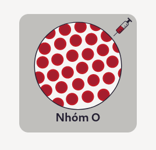
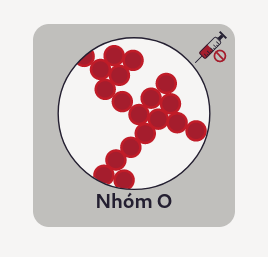

Quynhbio's Interactive Blood Compatibility Checker
==================================================

An interactive tool to learn about basic blood type compatibility, for educational purposes only.

This website was originally created at the request of my mother. Since this is a hobbyist project in nature, it is very basic in terms of features. Nevertheless, designing the entire website from scratch was a very valuable learning experience to myself.

# Technology
Although it is possible, and perhaps even recommended, to build the website using popular frameworks such as React, Vue or Svelt, I've decided to prioritize simplicity and accessibility.

## On the client side:
**Plain HTML, CSS and JavaScript:** This classic trio forms the foundation for the website's user interface and interactive features, ensuring compatibility across various devices and browsers. Given the relatively small scale of the project, this technology stack achieves the educational goals effectively.

## On the server side:
Since the website pretty much behaves similarly to a static site, there is no need for complex server-side logic. Thus, I've decided to set up a simple server using the following technologies:

* **Node.js:** This popular JavaScript runtime environment efficiently handles server-side operations.

* **Express:** This lightweight framework provides a structured approach to building the Node.js server, ensuring efficient organization and scalability.

* **Compression:** This library optimizes data transfer, resulting in faster loading times and a smoother user experience.

# Running From Source
Running Quynhbio's Interactive Blood Compatibility Checker from source is a relatively straightforward process as there is no compilation step involved.

To run the website from source, please make sure to download and install the following dependencies first:

* `node` >= `20.10.0`
* `compression` >= `1.7.4`
* `express` >= `4.18.2`

## Linux
To get started on Linux, first download Node.js using your package manager of choice. Please note that the exact package name may differ across distributions.

**Fedora**
``` sh
dnf install nodejs
```

**Debian**
``` sh
apt install nodejs
```

**Arch:**
``` sh
pacman -S nodejs-lts-iron
```

Next, clone the GitHub repository onto your system.
``` sh
git clone https://github.com/QingTian1927/Quynhbio-s-Interactive-Blood-Compatibility-Checker
```

Afterwards, `cd` to the cloned directory and install `npm` dependencies.
```
npm install
```

If `npm` successfully sets up the Node.js environment, simply launch the server with the following command:
```
node server.js
```

You should see the following message if everything goes well:
```
[2024-02-16T04:32:12.318Z] Blood Compatibility listening on port {<PORT NUMBER>}
```

where `<PORT NUMBER>` could be any number such as `4242` or `10000`.

## Windows (WIP)

# Usage Manual
**Note:** This is a very verbose instruction manual that explains the interactive elements of the website in a highly detailed manner. Since Quynhbio's Interactive Blood Compatibility Checker is designed to be as simple and intuitive as possible, you may skip this section if you wish to.

## 1. Selecting the donor's blood type
To mix two blood types together, one must first select the donor's blood type by clicking on 1 out of 4 available blood bags, each representing a particular blood type of the donor.

For example, to select the donor's type A blood, we must first move the mouse cursor to the blood bag representing type A blood. When we hasn't selected any donor's blood type, the mouse cursor, when hovered over any particular blood bag, will display an empty syringe like so:


_Figure 1.1: The mouse cursor when no donor's blood type has been selected_

When we click on a given blood bag, the mouse cursor will display a half-full syringe like so:


_Figure 1.2: The mouse cursor when a donor's blood type has been selected_

Whenever we select a donor's blood type, the currently selected blood type will be displayed in a circular notification icon next to the (**?**) button used to access the information page like so:


_Figure 1.3: A notification displaying the currenly selected blood type_

## 2. Mixing two blood types together
To mix two blood types together, one simply has to click on 1 out of 4 illustrations representing the recipient's blood type.

Supposing that we want to mix type A blood from the donor with type O blood from the recipient, we first move the cursor to the illustration representing the recipient's type O blood. When we hasn't clicked on the illustration, or when the recipient's blood type is still in a normal state (i.e. when mixed with a compatible type), the mouse cursor will display a half-full syringe like so:



_Figure 2.1: Type O blood before being mixed with type A blood_

Whenever we click on a illustration representing a recipient's blood type, we imagine that we are mixing the donor's blood type with the recipient's blood type. In the example above, since we are mixing type A blood with type O blood, the recipient's type O blood will agglutinate and clump together, indicating that type A and type O blood are not compatible like so:



_Figure 2.2: Type O blood agglutinating after being mixed with type A blood_

3. Restoring the initial state of recipient's blood types
When one mixes two incompatible blood types together, the cursor will display a half-full syringe with a red circle with a crossed diagonal line underneath (Refer to _Figure 2.1_). This signifies that we cannot mix an agglutinated blood type with another blood type.

Thus, in the example above, to mix the recipient's type O blood with another blood type, we must first restore the initial state of the recipient's blood types by clicking on the **Reset** button at the bottom of the page like so:


_Figure 3.1: The mouse cursor when hovered over the rest button_

After clicking on the **Reset** button, the page will be restored to its initial state, just like when we has opened the page for the first time.


