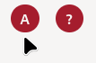

Giới Thiệu Về Công Cụ Kiểm Tra Các Nhóm Máu Tương Thích
=======================================================

# I. Giới thiệu khái quát
## 1. Mục đích
Việc xác định nhóm máu tương thích đóng vai trò quan trọng trong việc đảm bảo an toàn cho quá trình truyền máu. Trang web này được phát triển với mục đích hỗ trợ người dùng xác định nhóm máu tương thích và tra cứu thông tin hữu ích về việc truyền máu an toàn.

## 2. Một số lưu ý
* Đây chỉ là công cụ hỗ trợ tham khảo, vui lòng luôn tuân theo hướng dẫn của bác sĩ chuyên môn.
* Thông tin y tế trên trang web chỉ mang tính chất giáo dục và không thay thế được cho chẩn đoán hoặc điều trị y tế.
* Vui lòng liên hệ với bác sĩ nếu bạn có bất kỳ thắc mắc nào về nhóm máu của mình, hoặc nếu bạn có các vấn đề sức khỏe đặc biệt.

# II. Hướng dẫn sử dụng
## 1. Chọn nhóm máu người cho
Để trộn hai nhóm máu với nhau, ta trước hết phải chọn nhóm máu của người cho bằng cách ấn vào 1 trong 4 biểu tượng túi máu tượng trung cho một nhóm máu của người cho. 

Ví dụ như để chọn nhóm máu người cho là nhóm máu A, ta sẽ di chuyển con trỏ chuột ra chỗ biểu tượng túi máu nhóm A. Khi chưa chọn nhóm máu nào, hình con trỏ chuột, khi đưa vào gần một túi máu nào đó, sẽ hiện hình một ống tiêm trống không như sau:

Khi ấn vào biểu tượng một túi máu nào đó, con trỏ chuột sẽ hiện hình một ống tiêm nửa đầy như sau:

Khi đã chọn xong một nhóm máu, nhóm máu đang được chọn sẽ được hiển thị trong một biểu tượng hình tròn bên cạnh nút truy cập trang thông tin (**?**) ở đầu trang web như sau:

## 2. Trộn hai nhóm máu với nhau
Để trộn hai nhóm máu với nhau, ta chỉ cần ấn vào 1 trong 4 biểu tượng tượng trưng cho một nhóm màu của người nhận.

Giả dụ như ta muốn trộn nhóm máu A của người cho với nhóm máu O của người nhận, ta sẽ trước hết di chuyển con trỏ chuột tới biểu tượng nhóm máu O của người nhận. Khi đã chọn một nhóm máu người cho như ở trên bước 1, con trỏ chuột sẽ hiện hình một ống tiêm nửa đầy như sau:

Khi ấn vào biểu tượng nhóm máu của người nhận, ta hiểu là ta đang trộn nhóm máu của người cho với nhóm máu của người nhận. Trong trường hợp này, bởi vì ta đang trộn nhóm máu A với nhóm máu O, nhóm máu O sẽ bị kết dính và sẽ hiển thị hình như sau:

## 3. Khôi phục trạng thái ban đầu của công cụ
Khi nhóm máu người nhận kết dính sau khi trộn với nhóm máu của người cho, con trỏ chuột sẽ hiện hình một ống tiêm nửa đầy với hình tròn đỏ gạch chéo ở bên dưới (tham khảo hình 2 ở bước 2). Điều này có nghĩa là ta không thể trộn một nhóm máu đã bị kết dính với một nhóm máu nữa.

Ở trong ví dụ ở bước 2, để trộn nhóm máu O của người nhận với một nhóm máu khác của người cho, ta sẽ phải khôi phục trạng thái ban đầu của công cụ bằng cách ấn nút **Reset** ở cuối trang.

Khi ấn xong, công cụ sẽ được đưa lại về trạng thái ban đầu như khi mới mở trang web.

# III. Thông tin về trang web
Trang web được lập trình chỉ sử dụng 3 ngôn ngữ **HTML**, **CSS** và **JavaScript** cơ bản. Phần mềm server-side được xây dựng với môi trường runtime **Node.js** sử dụng một vài công cụ bên thứ 3 như `express` và `compression`.

**Công Cụ Kiểm Tra Các Nhóm Máu Tương Thích** (tên tiếng Anh là _Quynhbio's Interactive Blood Compatibility Checker_) là một công cụ mã nguồn mở được xuất bản theo bản quyền **GNU General Public License version 3** (tạm dịch: _Giấy phép Công cộng GNU phiên bản 3_). Chi tiết cụ thể vui lòng tham khảo nguyên văn của bản quyền GNU theo đường dẫn sau: [https://www.gnu.org/licenses/gpl-3.0.en.html](https://www.gnu.org/licenses/gpl-3.0.en.html)

Đường dẫn tới mã nguồn của trang web trên **GitHub**: [https://example.com/](https://example.com/)

Nếu bạn có bất kỳ thắc mắc nào trong quá trình sử dụng trang web, bạn có thể liên hệ với nhà phát triển ở trong mục **Discussions** của trang web mã nguồn. Đối với những vấn đề hoặc sự cố kỹ thuật, bạn có thể yêu cầu trợ giúp ở trong mục **Issues**.

# IV. Thông tin vê tác giả

Ký hiệu `---` chỉ những mục thông tin đã được ẩn đi dể đảm bảo quyền riêng tư của tác giả.

## Tác giả 1
* **Họ và tên:** Nguyễn Thị Như Quỳnh
* **Đơn vị công tác:** THCS Trần Đăng Ninh
* **Huyện/TP:** `---`
* **SĐT:** `---`
* **Email:** `---`

## Tác giả 2
* **Họ và tên:** Bùi Xuân Quỳnh
* **Đơn vị công tác:** THCS Trần Đăng Ninh
* **Huyện/TP:** `---`
* **SĐT:** `---`
* **Email:** `---`